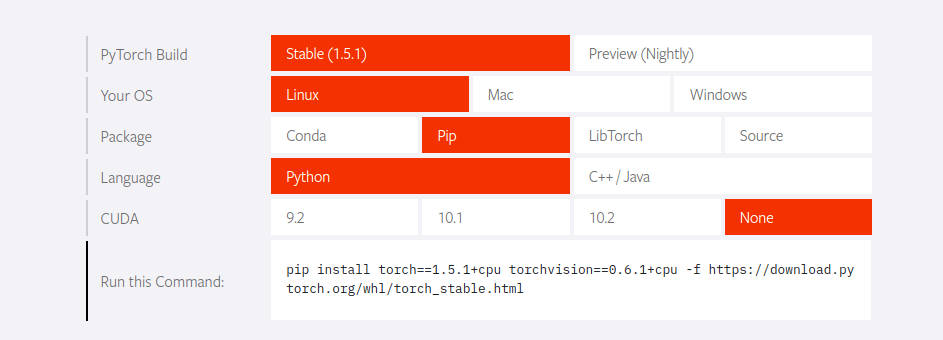
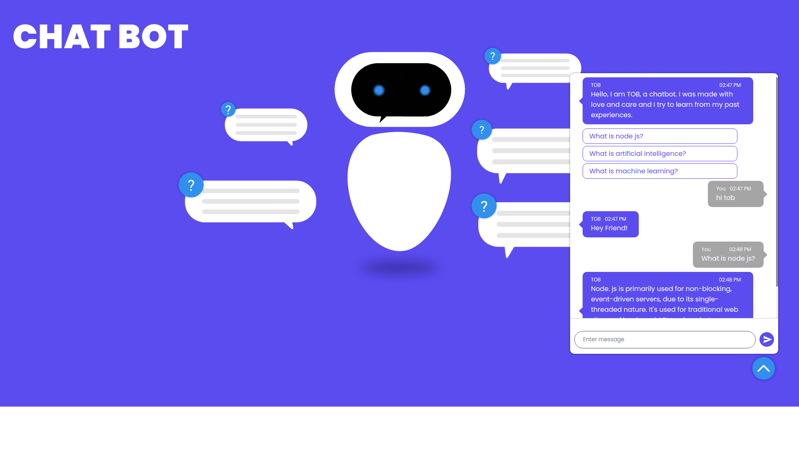

# Chatbot Implementation on websites
> This is a simple chatbot with a frontend interface. <br/> Programming languages used: __python__, __nodejs__, __html__, __css__ and __javascript__.
## Modules, packages and dependencies 
---
### Python:
1. Install PyTorch [(click here)](https://pytorch.org/). Select your peferences carefully. I have used used pip for installation. Option for installing with conda is also available.



2. Natural Language Toolkit or NLTK. <br/>You will also need punkt.
    ```console
    pip3 install ntlk

    $ python3
    >>> import ntlk
    >>> nltk.download('punkt')
    ```
---
### Nodejs:
1. Express for creating server. 
    ```console
    npm install express
    ```
2. Python-shell. Is is used for connecting python script with nodejs.
    ```console
    npm install python-shell
    ```
3. Nodemon a dev dependency.
    ```console
    npm install --save-dev nodemon
    ```
4. Simply run __npm install__ in the terminal to install all the packages.
---
## Running the application
The model is already trained. <br>
Change the intents.json file according to your choices and retrain the model. This will create a new data.pth file.<br/>
In the root of the folder run the command __npm start__ to start the server. Go to http://localhost:5000 after the connection is established.

